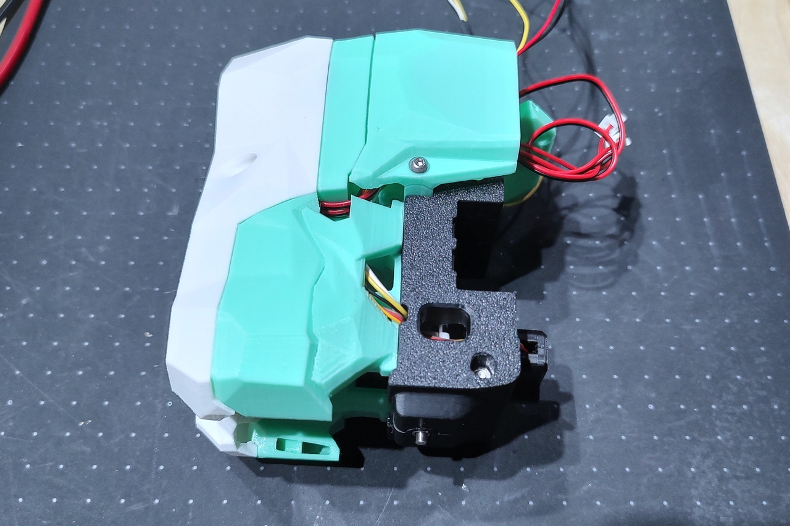

# Retractable probe built into X-carriage
 

The retractable probe of the Strix toolhead has been miniaturized and integrated into the X-carriage.  
The project features the following.

- Fits MGN12 X-rail only
- Replaces OMRON TL-Q5MC, which has concerns about heat resistance.
- Same size as the genuine VORON X-Carriage, so AfterBurner and StealthBurner can be used.
- Same weight as the genuine VORON X-Carriage with OMRON TL-Q5MC.
- Robust electrical circuits with no magnet-dependent electrical contacts.
- The accuracy of the probe depends only on the accuracy of the microswitch and not on the servomotor or spring.

# Caution
This probe is still under development and has not yet been tested for stability.   
I am trying to design a better, but something could go wrong and your 3D printer could break.

# BOM
- M3 x 30mm SHCS x1
- M3 x 40mm SHCS x1
- M2x10 Self Tapping Screw x4
- M1.7 x 3mm Flat Head Screw x1 (for servo horn)
- M3 x 6mm Set Screw x1
- M3 Hexnut x2
- M3 Heat Set Inserts x4
- Piano wire 0.8mm(D) x 6mm(L) x1
- Sleeve Bearing(Oilless Bushings) 3mm(ID) x 5mm(OD) x 5mm(L) x4
- Stainless Steel Compression Spring 4mm(OD) x 0.4mm(RD) x 15mm(L) x1
- Stainless Steel Shaft 3mm(D) x 57mm(L) x1
- E-Clip 2.0~2.5mm(ID) x2
- Wire 32~36AWG
- Micro Switch (OMRON D2F-01F Low operating force 0.74 N) x1
- Servo Motor (Dspower DS-M005) x1

LED Options
- LED Blue 3mm x1
- LED Red 3mm x1
- Resistor 1/4W 330~2k ohms x2 (Resistance depends on circuit)

